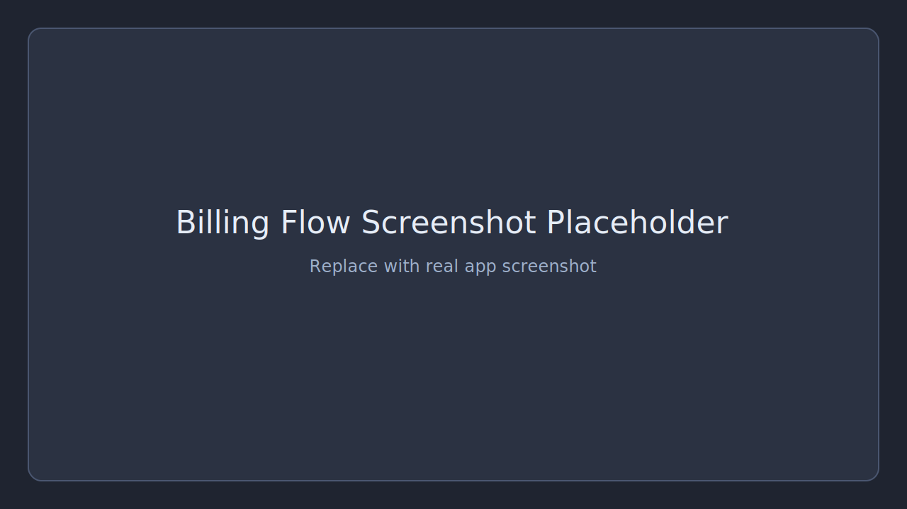
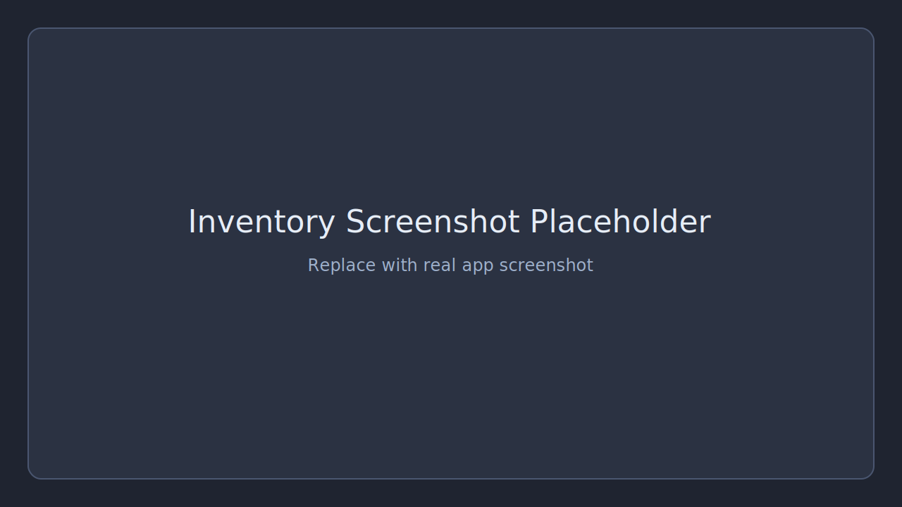
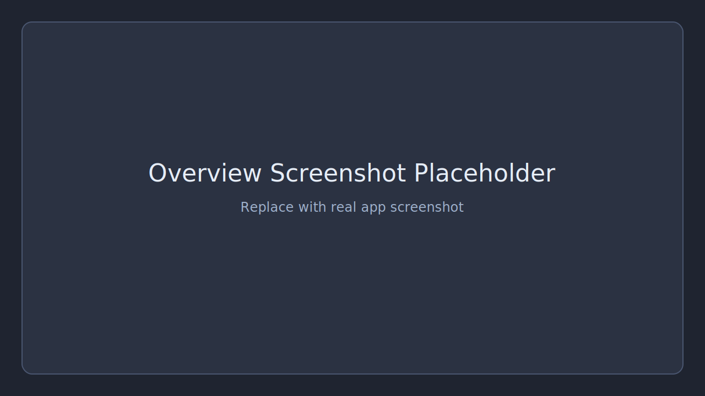
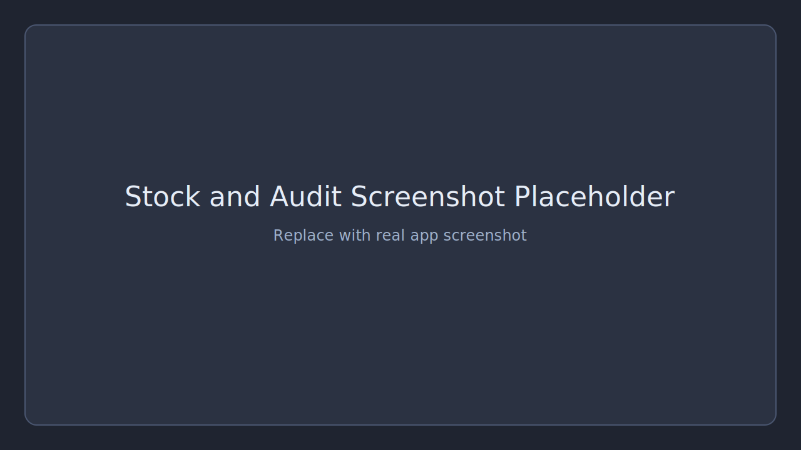
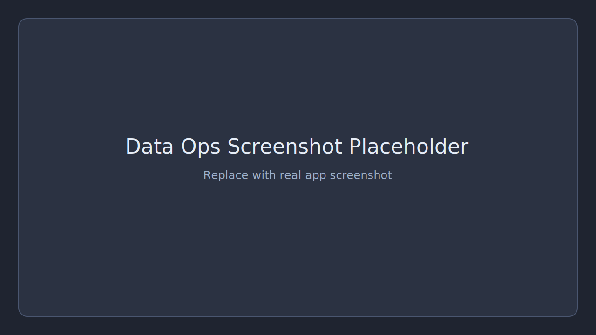

# Cafe POS and Bookkeeping (Offline)

Open-source offline Windows desktop POS for cafe operations, bookkeeping, reporting, and safe local backups.

This README includes development and release operations details so other contributors can run, test, and package the app reliably.

## Quick Start

```powershell
python -m venv .venv
.\.venv\Scripts\Activate.ps1
pip install -r requirements.txt
python main.py
```

## Screenshots







## 1. Project Goal

Build a practical, fully offline Windows desktop app for cafe operations with:

1. Fast POS billing
2. Inventory control
3. Purchases and expenses tracking
4. Daily profitability view
5. Local backup and restore
6. Installable release artifacts (zip + setup exe)

No cloud dependency is required for daily operation.

## 2. Current Status

Overall state: production-usable for single-user shop floor and owner bookkeeping.

Completed high-impact areas:

1. Core billing and stock integrity
2. Purchases and expenses workflows
3. Reporting with realistic daily profitability
4. CSV export flows (including export-all)
5. Automated hard-smoke regression
6. Versioned release pipeline with Windows packaging
7. Restore pre-check and backup automation
8. Audit logging and role split (cashier/admin)
9. XLSX and printable summary reporting outputs

## 3. Tech Stack

1. UI: PySide6
2. DB: SQLite (local file)
3. Language: Python 3.14 (venv)
4. Packaging:
   - PyInstaller for portable app folder
   - Inno Setup for installer exe

## 4. Workspace Structure (Important Files)

1. App entry: main.py
2. UI: app/ui/main_window.py
3. DB schema and connection:
   - app/database/schema.sql
   - app/database/connection.py
   - app/database/repository.py
4. Services:
   - app/services/sales_service.py
   - app/services/inventory_service.py
   - app/services/bookkeeping_service.py
   - app/services/report_service.py
   - app/services/print_service.py
5. Utilities:
   - app/utils/backup.py
6. Regression and release automation:
   - scripts/hard_smoke.py
   - scripts/release.ps1
   - installer/CafePOS.iss
   - VERSION

## 5. Feature Coverage (Implemented)

### 5.1 Billing

1. Search catalog and add to cart
2. Cart corrections: increase qty, decrease qty, remove selected, clear cart
3. Transactional checkout with stock decrement
4. Sequential invoice numbering (CAFE-000001 and onward)
5. Print-safe flow: sale saved first, print retry on failure
6. Pending cart autosave and recovery after restart

### 5.2 Cigarette-focused fast UX

1. Quick-add grouped by size band (small/medium/big)
2. Numeric shortcuts for quick buttons
3. Starter cigarette SKU loader

### 5.3 Inventory

1. Add item with category, sell/cost, stock, reorder
2. Inline edit for selling price and reorder level
3. Manual stock adjust (admin PIN)
4. Soft delete item (admin PIN)
5. Low-stock logic and view

### 5.4 Purchases

1. Create multi-line purchases
2. Inline edit for purchase line qty/cost before save
3. Modify existing purchase (admin PIN)
4. Correct stock reversal + re-apply during purchase edits
5. Date-range filtering and quick filters

### 5.5 Expenses

1. Add expense entries
2. Inline edit for type, amount, notes
3. Date-range filtering and quick filters

### 5.6 Reports

1. Reports are split into workflow tabs: Overview, Stock and Audit, Data Ops
2. Summary cards for sales, COGS, gross, purchases, expenses, fixed/day, realistic net
3. Realistic net profit based on daily fixed overhead
4. Date-range aware trend, top-items, and stock ledger
5. Quick filters: Today, Last 7 Days, This Month, Custom
6. Data Ops contains close-day, backup/restore, fixed costs, and report exports

### 5.7 Export, Backup, Restore

1. CSV export in Inventory, Purchases, Expenses, Reports
2. Export respects active filters/range
3. Export All CSV (inventory.csv, purchases.csv, expenses.csv, reports.csv)
4. Open-after-export toggle
5. Backup now, export backup, restore backup
6. Restore pre-check preview (current DB vs backup counts before overwrite)
7. Scheduled backup automation (interval + enable/disable)

### 5.8 Audit and Access Control

1. Audit log table with sensitive action history
2. Logged actions include pricing edits, stock adjustments, purchase updates, deletes, backup/restore, role switch, and exports
3. Role split: cashier and admin
4. Admin role switch requires PIN; cashier role requests PIN only on sensitive actions

### 5.9 Reporting Polish

1. XLSX multi-sheet report export (Summary, Sales Trend, Top Items, Low Stock, Ledger)
2. Printable summary export
3. Extra report filters for Top Items limit and Ledger limit

## 6. Data and Safety Notes

1. Primary DB file: data/cafe.db
2. Foreign keys enabled
3. Stock non-negative enforced via logic + checks
4. Default admin PIN is stored in app settings (initial default: 1234)
5. Stock movement ledger captures sale/purchase/manual/edit movements

## 7. Local Development

### 7.1 Setup

```powershell
python -m venv .venv
.\.venv\Scripts\Activate.ps1
pip install -r requirements.txt
```

### 7.2 Run

```powershell
python main.py
```

## 8. Regression Testing (Mandatory Before Release)

Permanent hard-smoke script:

```powershell
python scripts/hard_smoke.py
```

Expected terminal output includes:

1. HARD_SMOKE_PASS

Optional debug mode (keep temporary DB):

```powershell
python scripts/hard_smoke.py --keep-db
```

What this test currently validates:

1. Category and item creation
2. Purchase creation and stock increase
3. Expense creation
4. Checkout and invoice sequence
5. Purchase edit reconciliation logic
6. Date-range queries (purchases/expenses/reports)
7. Trend/top-items/ledger data retrieval
8. Close-day duplicate protection
9. Validation failures (oversell, invalid PIN)

## 9. Versioned Release Process

### 9.1 Set version

Update VERSION file (example: 1.0.1).

### 9.2 One-command release

```powershell
powershell -ExecutionPolicy Bypass -File scripts/release.ps1
```

Pipeline steps:

1. Run hard smoke
2. Build exe bundle using PyInstaller
3. Build setup installer using Inno Setup (if available)
4. Create versioned folder under release/v<version>
5. Generate manifest with artifact paths

Useful flags:

```powershell
powershell -ExecutionPolicy Bypass -File scripts/release.ps1 -Version 1.0.1
powershell -ExecutionPolicy Bypass -File scripts/release.ps1 -SkipSmoke
powershell -ExecutionPolicy Bypass -File scripts/release.ps1 -SkipInstaller
```

### 9.3 Artifacts

Generated in release/v<version>/:

1. CafePOS-v<version>-win64.zip
2. CafePOS-v<version>-setup.exe (when installer build succeeds)
3. manifest.txt
4. dist/ and build/ staging folders

## 10. Installer Details

1. Installer script: installer/CafePOS.iss
2. Inno Setup compiler: ISCC.exe
3. Release script includes fallback ISCC path discovery:
   - PATH lookup
   - common install folders
   - uninstall registry locations

## 11. Dependencies

Current requirements (requirements.txt):

1. PySide6==6.8.3
2. pyinstaller==6.19.0
3. openpyxl==3.1.5

## 12. Internal Documentation Set

1. Operator manual: docs/operator_manual.md
2. Troubleshooting guide: docs/troubleshooting.md
3. Daily closing checklist: docs/daily_closing_checklist.md
4. Contribution guide: CONTRIBUTING.md
5. License: LICENSE

## 13. Known Gaps / Next Improvements

High-priority technical debt:

1. No formal unit-test suite yet (hard-smoke exists, but no granular unit tests)
2. No signed binaries/installer (code signing pending)
3. No per-user identity in audit trail (role is tracked, named user accounts are not)
4. No dry-run restore content diff beyond record counts

Product polish opportunities:

1. Additional report dimensions and saved filter presets
2. Role permissions matrix per module (beyond cashier/admin)
3. Installer branding/icon + uninstall data migration checks
4. Audit export and archive policy

## 14. Release Checklist (Internal)

Before shipping a new version:

1. Update VERSION
2. Run release script without skipping smoke
3. Verify hard-smoke PASS
4. Verify app launches from built exe
5. Verify installer install/uninstall on test machine
6. Verify DB create/open/upgrade behavior on clean and existing data
7. Archive release artifacts and manifest

## 15. Notes

1. This README is intentionally internal and operational.
2. Client-facing documentation should be a separate simplified handover file.
